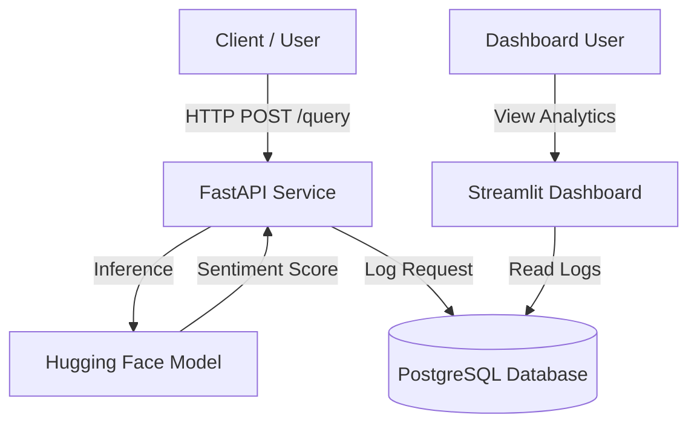

# ❯❯❯❯ Sentiment Analysis Microservice

[](https://www.python.org/)
[](https://fastapi.tiangolo.com/)
[](https://www.docker.com/)
[](https://www.postgresql.org/)
[](https://huggingface.co/docs/transformers)

A production-ready microservice for real-time sentiment analysis, built with **FastAPI**, **Hugging Face Transformers**, and **PostgreSQL**. This project demonstrates an ML pipeline from model inference to data persistence and visualization.

## Architecture

The system is composed of three main containerized services orchestrated by Docker Compose:



## Key Features

- **High-Performance API**: Built on FastAPI for asynchronous processing and high throughput.
- **State-of-the-Art NLP**: Utilizes a pre-trained `distilbert-base-uncased` model fine-tuned for sentiment analysis.
- **Persistent Logging**: Automatically captures all requests, predictions, and confidence scores in a PostgreSQL database.
- **Interactive Dashboard**: Real-time visualization of sentiment trends and data distribution using Streamlit.
- **Containerized Deployment**: Fully Dockerized environment ensuring consistency across development and production.

## Project Structure

```text
sentiment-analysis-microservice/
├── app/                    # Main FastAPI application
│   ├── main.py             # API endpoints and logic
│   └── ...
├── dashboard/              # Streamlit visualization app
│   ├── app.py              # Dashboard logic
│   └── Dockerfile          # Dashboard specific container
├── assets/                 # Static assets (images, etc.)
├── compose.yaml            # Docker Compose orchestration
├── Dockerfile              # API container definition
├── requirements.txt        # Python dependencies
└── README.md               # Project documentation
```

## Technical Details

### Machine Learning Model
We use **DistilBERT** (`distilbert-base-uncased-finetuned-sst-2-english`), a smaller, faster, cheaper, and lighter version of BERT. It offers 97% of BERT's performance while being 40% lighter and 60% faster, making it ideal for real-time microservices where latency is critical.

### Database Design
**PostgreSQL** is used for its reliability and robust support for structured data. The application uses **SQLAlchemy** as an ORM to interact with the database, ensuring SQL injection protection and easy schema management.
- **Schema**: `query_logs` table stores timestamp, input text, predicted label, and confidence score.

### Containerization
The project uses a multi-container **Docker** setup:
1.  **API Service**: Runs the FastAPI app.
2.  **Database**: Official PostgreSQL image.
3.  **Dashboard**: Streamlit app for analytics.
All services communicate via a private Docker network, with only necessary ports exposed to the host.

## Getting Started

### Prerequisites
- [Docker](https://www.docker.com/) and [Docker Compose](https://docs.docker.com/compose/) installed.

### Installation

1.  **Clone the repository**
    ```bash
    git clone https://github.com/mkPuzon/sentiment-analysis-microservice.git
    cd sentiment-analysis-microservice
    ```

2.  **Configure Environment**
    Create a `.env` file in the root directory:
    ```ini
    POSTGRES_USER=testuser
    POSTGRES_PASSWORD=testpass
    POSTGRES_DB=testdb
    POSTGRES_HOST=db
    POSTGRES_PORT=5432
    DATABASE_URL=postgresql+psycopg2://testuser:testpass@db:5432/testdb
    ```

3.  **Build and Run**
    ```bash
    docker-compose up --build
    ```
    *Note: The first run will download the ML model (~250MB), which may take a moment.*

## API Usage

Once running, the API is available at `http://localhost:8000`.

- **Swagger UI**: Interactive documentation at `http://localhost:8000/docs`
- **ReDoc**: Alternative documentation at `http://localhost:8000/redoc`

### Example Query
```bash
curl -X POST "http://localhost:8000/query" \
     -H "Content-Type: application/json" \
     -d '{"text": "Hey this project is pretty cool!"}'
```

**Response:**
```json
{
  "input_text": "Hey this project is pretty cool!",
  "sentiment_label": "POSITIVE",
  "sentiment_score": 0.9998
}
```

## Analytics Dashboard

Access the live dashboard at `http://localhost:8501`.


The dashboard provides real-time insights:
- **Sentiment Distribution**: Pie chart of Positive vs. Negative queries.
- **Confidence Analysis**: Histogram showing model certainty.
- **Temporal Trends**: Scatter plot of sentiment over time.
